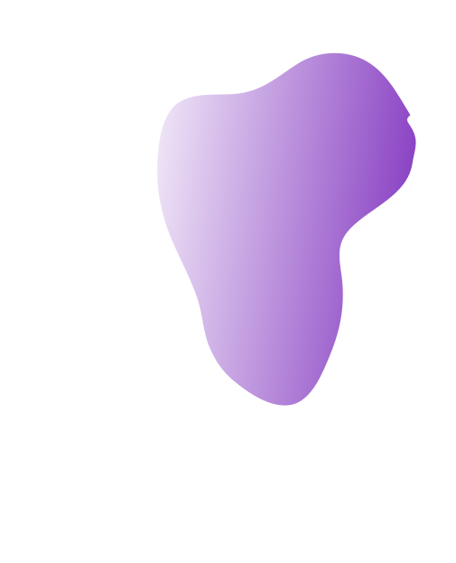

<!doctype html>
<html lang="en">

<head>
  <meta charset="utf-8">
  <meta name="viewport" content="width=device-width, initial-scale=1.0">
  <title>Rohan Portfolio</title>
  <link href="https://cdn.jsdelivr.net/npm/bootstrap@5.3.3/dist/css/bootstrap.min.css" rel="stylesheet"
    integrity="sha384-QWTKZyjpPEjISv5WaRU9OFeRpok6YctnYmDr5pNlyT2bRjXh0JMhjY6hW+ALEwIH" crossorigin="anonymous">
  <link rel="preconnect" href="https://fonts.googleapis.com">
  <link rel="preconnect" href="https://fonts.gstatic.com" crossorigin>
  <link
    href="https://fonts.googleapis.com/css2?family=Poppins:ital,wght@0,100;0,200;0,300;0,400;0,500;0,600;0,700;0,800;0,900;1,100;1,200;1,300;1,400;1,500;1,600;1,700;1,800;1,900&display=swap"
    rel="stylesheet">
  <link rel="preconnect" href="https://fonts.googleapis.com">
  <link rel="preconnect" href="https://fonts.gstatic.com" crossorigin>
  <link
    href="https://fonts.googleapis.com/css2?family=Inter:wght@100..900&family=Poppins:ital,wght@0,100;0,200;0,300;0,400;0,500;0,600;0,700;0,800;0,900;1,100;1,200;1,300;1,400;1,500;1,600;1,700;1,800;1,900&display=swap"
    rel="stylesheet">
  <link rel="stylesheet" href="css/style.css">
  <link rel="stylesheet" href="css/responsive.css">
</head>

<body>
  <nav class="navbar navbar-expand-lg ">
    

      
      <button class="navbar-toggler shadow-none border-0" type="button" data-bs-toggle="offcanvas"
        data-bs-target="#offcanvasNavbar" aria-controls="offcanvasNavbar" aria-label="Toggle navigation">
        
      </button>
      

        

          <h5 class="offcanvas-title" id="offcanvasNavbarLabel">
            
          </h5>
          <button type="button" class="btn-close btn-close-black border-0 shadow-none" data-bs-dismiss="offcanvas"
            aria-label="Close"></button>
        

        

          <ul class="navbar-nav justify-content-end flex-grow-1 pe-3">
            <li class="nav-item">
              <a class="nav-link active text-dark" aria-current="page" href="#">Home</a>
            </li>
            <li class="nav-item text-dark">
              <a class="nav-link text-secondary" href="#scrollspyHeading1">About</a>
            </li>
            <li class="nav-item">
              <a class="nav-link text-secondary" href="#scrollspyHeading2">Services</a>
            </li>
            <li class="nav-item">
              <a class="nav-link text-secondary" href="#scrollspyHeading3">Skills</a>
            </li>
            <li class="nav-item">
              <a class="nav-link text-secondary" href="#">Portfoilio</a>
            </li>
            <li class="nav-item">
              <a class="nav-link text-secondary" href="#">Contact Us</a>
            </li>
            <!-- <li class="nav-item dropdown">
              <a class="nav-link dropdown-toggle" href="#" role="button" data-bs-toggle="dropdown"
                aria-expanded="false">
                Dropdown
              </a>
              <ul class="dropdown-menu">
                <li><a class="dropdown-item" href="#">Action</a></li>
                <li><a class="dropdown-item" href="#">Another action</a></li>
                <li>
                  

                </li>
                <li><a class="dropdown-item" href="#">Something else here</a></li>
              </ul>
            </li> -->
          </ul>
          <!-- <form class="d-flex mt-3" role="search">
            <input class="form-control me-2" type="search" placeholder="Search" aria-label="Search">
            <button class="btn btn-outline-success" type="submit">Search</button>
          </form> -->
        

      

    

  </nav>
  

    
  

  <!--hero-->
  

    

      

        

          

            
          

        

      

      

        <h1>Hi There !</h1>
        

          I’M A 
          

            <ul>
              <li style="color: #8B44C4">Web Designer</li>
              <li style="color: #8B44C4">UI/UX Designer</li>
              <li style="color: #8B44C4">Web Developer</li>
              <li style="color: #8B44C4">Web Designer</li>
              <li style="color: #8B44C4">UI/UX Designer</li>
            </ul>
          

        

        
I’m a UI Designer and Developer based in Kolkata,Hooghly. I Strives to build immersive and
          beautiful Web application throughcarefully crafted code and user-centric design.

        

          <button class="btn btn-primary hero-buttons about-btn" type="button">About Me</button>
          <button class="btn btn-primary hero-buttons portfolio-btn" type="button">Portfolio</button>
        

      

    

  

  <!-- /hero-->

  <!--About Us-->
  

    <!-- 

      
    
 -->
    

      <h1 class="main-title">About Us</h1>
      <h2 class="sub-heading">Hi, I’m Rohan De</h2>
      
I’m a designer & developer with a passion for web design. I enjoy developing
        simple, clean and slick websites that provide real value to the end user.
        Thousands of clients have procured exceptional results while working with me.
        Delivering work within time and budget which meets client’s requirements is our
        moto.

      

        

          

            Name:
            
Rohan De

          

          

            Email:
            
rohande2402@gmail.com

          

          

            Date of birth:
            
24 February 2002

          

          

            From:
            
Dhaniakhali, Hooghly

          

        

      

    

  

  <!-- /About US-->

  <!--services-->
  

    

      <h1 class="main-title">Services</h1>
      
Lorem ipsum dolor sit amet, consectetur adipiscing elit. Mauris
        ipsum sit nibh amet egestas tell us.

      

        
      

      

        

          Web Developer
          
Lorem Ipsum is simply dummy text of the
            printing and typesetting industry. Lorem
            Ipsum has been the industry’s standard
            dummy text.

        

        

          Web Design
          
Lorem Ipsum is simply dummy text of the
            printing and typesetting industry. Lorem
            Ipsum has been the industry’s standard
            dummy text.

        

        

          UI/UX Design
          
Lorem Ipsum is simply dummy text of the
            printing and typesetting industry. Lorem
            Ipsum has been the industry’s standard
            dummy text.

        

        

          PSD to HTML
          
Lorem Ipsum is simply dummy text of the
            printing and typesetting industry. Lorem
            Ipsum has been the industry’s standard
            dummy text.

        

        

          Figma Design
          
Lorem Ipsum is simply dummy text of the
            printing and typesetting industry. Lorem
            Ipsum has been the industry’s standard
            dummy text.

        

      

    

  

  <!--/ services-->

  <!--skills-->
  

    

      <h1 class="main-title">My Skills</h1>
      

        

          

            
            
UI/UX Design

          

          

            
            
HTML5

          

          

            
            
CSS3

          

          

            
            
JavaScript

          

          

            
            
Bootstrap

          

          

            
            
JQuery

          

          

            
            
Figma

          

          

            
            
Photoshop

          

        

      

    

  

  <!--/ Skills-->
  
  
  
</body>

</html>
